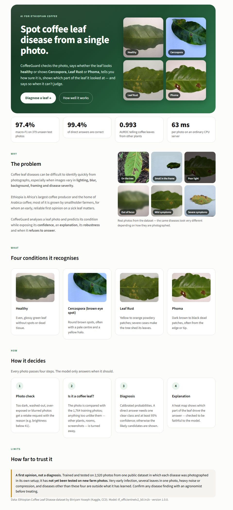
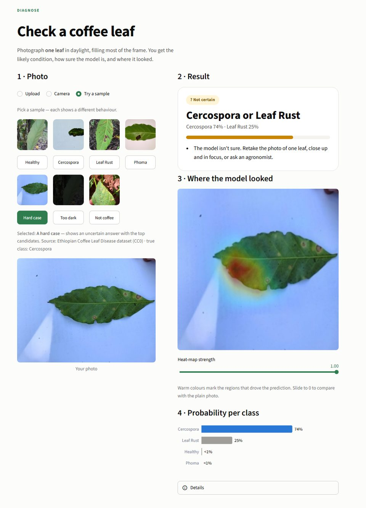
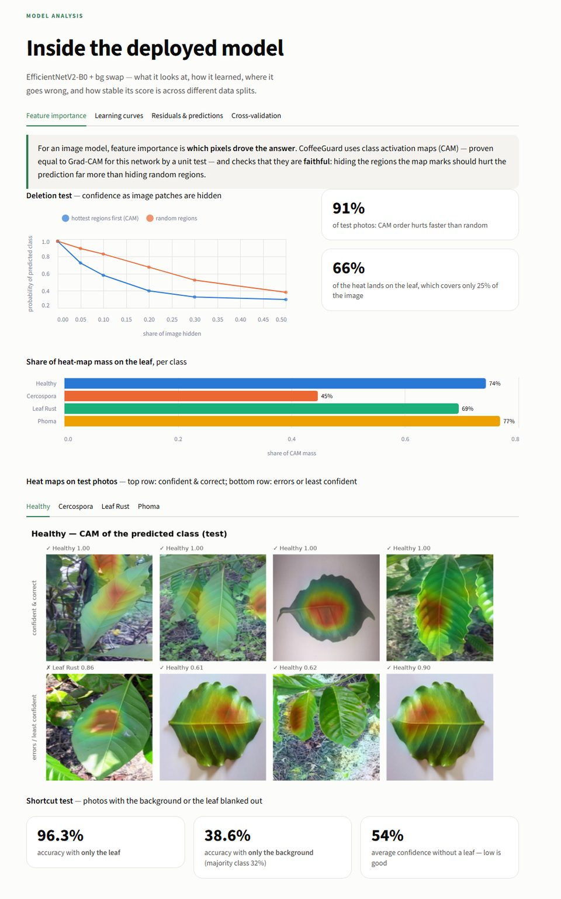
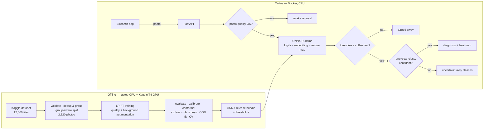

# 🍃 CoffeeGuard AI

> **Coffee leaf disease detection for Ethiopian coffee — with confidence, explanations, robustness checks, and the sense to say "I can't tell".**

[](LICENSE)
[](https://www.python.org/downloads/)
[](CHANGELOG.md)
[](https://github.com/Ab-xo/coffee-guard-ai/actions)

Coffee leaf diseases can be difficult to identify quickly from photographs, especially when images vary in lighting, blur, background, framing and disease severity. CoffeeGuard analyses a photo of one coffee leaf and predicts whether it is **Healthy** or shows **Cercospora**, **Leaf Rust** or **Phoma** — and exposes how **confident** it is, **where it looked**, how **robust** it is, and when it **refuses to answer**.

| Home | Diagnose | Model Analysis |
|---|---|---|
|  |  |  |

---

## 🚀 Quick start

**With Docker** (nothing else needed):

```bash
git clone https://github.com/Ab-xo/coffee-guard-ai.git
cd coffee-guard-ai
docker compose up --build
```

- Web app → <http://localhost:8501> (try <http://localhost:8501/diagnose?sample=leaf_rust>)
- API docs → <http://localhost:8000/docs>

**With [uv](https://docs.astral.sh/uv/)** (for development):

```bash
uv sync --all-extras
uv run uvicorn app.main:app --app-dir apps/api          # API on :8000
uv run streamlit run apps/web/streamlit_app.py          # web app on :8501 (second terminal)
```

The trained model ships in the repository (`artifacts/models/coffeeguard-effv2b0-v1`, 28 MB), so neither route needs the dataset or a GPU. A 5-minute walkthrough: [`docs/DEMO.md`](docs/DEMO.md).

---

## 📊 Results

Deployed model: **EfficientNetV2-B0** (transfer learning, background-swap augmentation), evaluated once on **379 held-out test photos**:

| Measure | Value |
| --- | --- |
| Macro-F1 [95% bootstrap CI] | **0.974** [0.956, 0.990] — per class 0.964–0.986 |
| 5-fold group cross-validation | 0.985 ± 0.007 |
| Calibration error (ECE) | 0.097 → **0.014** after temperature scaling |
| Answered directly / accuracy of those answers | **90.8% / 99.4%** (7.4% *uncertain* with the likely classes, 1.8% turned away) |
| Telling coffee leaves from other plant leaves / from non-leaf images | AUROC **0.993 / 1.000** (image sources never used for tuning) |
| Score kept under moderate blur, noise, darkness, JPEG, occlusion … | 97.9% |
| Heat maps | faithful (deletion test) · 66% of the heat on the leaf |
| Speed on a CPU server | 15 ms per forward pass · 63 ms for a full 2048 px phone photo |

Five models were compared on the same recipe — see the **Model Comparison** page or the [decision record](docs/decisions/001-deployment-model.md).

**Limits:** trained and tested on one public dataset whose classes were photographed in different setups; **not yet validated on new farm photos**; very early infection, several leaves per photo, heavy noise/compression and diseases other than these four are outside what it has learned. A first opinion, not a diagnosis. Details: [model card](docs/MODEL_CARD.md).

---

## 🧭 How it works



---

## 🗂 Project structure

```text
coffee-guard-ai/
├── src/coffeeguard/        # the library + `coffeeguard` CLI (data, training, evaluation,
│   └── inference/          #   explainability, robustness, OOD); inference/ is torch-free
├── apps/api/               # FastAPI service
├── apps/web/               # Streamlit app: Home, Diagnose, Model Comparison, EDA,
│                           #   Model Analysis, About Team
├── configs/                # data, training recipes, CV folds
├── data/splits*/           # committed train/val/test split and CV folds
├── artifacts/              # release bundle, metrics, figures, reports (committed)
├── kaggle/                 # remote GPU training kernel
├── tests/                  # unit, API and headless-UI tests
├── docs/                   # report, model & data cards, decisions, progress log
├── Dockerfile.api  Dockerfile.web  docker-compose.yml
└── pyproject.toml  uv.lock
```

## 🔁 Reproduce the pipeline

Every step is one command (details and all numbers: [technical report §10](docs/TECHNICAL_REPORT.md#10-reproducing)):

```bash
uv run coffeeguard data download        # Kaggle -> data/raw
uv run coffeeguard data prepare         # validate, embed, dedup/group, split
uv run coffeeguard remote train -c configs/train/effnetv2_b0_bgswap.yaml    # Kaggle T4
uv run coffeeguard export --run runs/<run> --name <bundle>
uv run coffeeguard evaluate -b artifacts/models/<bundle>
uv run coffeeguard ood fit -b artifacts/models/<bundle>
```

Tests and lint: `uv run pytest` · `uv run ruff check . && uv run ruff format --check .`

---

## 📚 Documentation

- **[Technical report](docs/TECHNICAL_REPORT.md)** — data, method, experiments, results, limitations
- **[Model card](docs/MODEL_CARD.md)** · **[Data card](docs/DATA_CARD.md)** · **[Deployment decision](docs/decisions/001-deployment-model.md)**
- **[Demo script](docs/DEMO.md)** — a 5-minute walkthrough
- **[Progress log](docs/PROGRESS.md)** — every step, number and decision · **[Changelog](CHANGELOG.md)**
- **[Implementation plan](docs/IMPLEMENTATION_PLAN.md)** · **[Original specification](docs/PROJECT_SPECIFICATION.md)** · **[Contributing](CONTRIBUTING.md)**

## 📄 License

MIT — see [LICENSE](LICENSE).

## 🙏 Acknowledgements

- **Data:** [Ethiopian Coffee Leaf Disease dataset](https://www.kaggle.com/datasets/biniyamyoseph/ethiopian-coffee-leaf-disease) by Biniyam Yoseph (CC0); out-of-distribution test images from the sources listed in the [data card](docs/DATA_CARD.md)
- **Compute:** Kaggle free GPU
- **Open source:** PyTorch, timm, ONNX Runtime, scikit-learn, FastAPI, Streamlit, Altair, cleanlab

<div align="center"><strong>Built with ❤️ for Ethiopian coffee farmers</strong></div>
