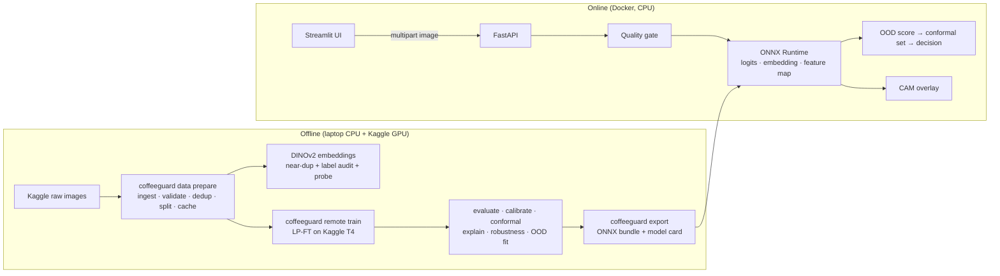

# CoffeeGuard AI — Implementation Plan

**Status:** Active · **Context:** built by one developer (the original team-process docs were retired in Phase 1 cleanup) · **Requirements baseline:** [`PROJECT_SPECIFICATION.md`](PROJECT_SPECIFICATION.md) and [`CoffeeGuard_AI_Project_Structure.md`](../CoffeeGuard_AI_Project_Structure.md)

This plan keeps every requirement from the specification (4 classes, stratified 70/15/15, 224×224 input, EfficientNetV2-B0 as the primary model, Grad-CAM, robustness, OOD rejection, FastAPI + Streamlit) and upgrades *how* each is delivered: a typed, tested library driven by one CLI, remote GPU training launched from the repo, leakage-proof data handling, calibrated uncertainty, and a torch-free ONNX serving path.

---

## 1. Guiding principles

1. **Library + CLI, not notebooks.** All logic lives in `src/coffeeguard/` and is run through `uv run coffeeguard …`. Notebooks only load artifacts and tell the story; they never hold logic that a result depends on.
2. **Walking skeleton first.** By the end of Day 2 a (weak) model is trained, exported, served by the API and visible in the UI. Every later day improves a system that already works end to end.
3. **The test set is sealed.** All selection, tuning, calibration and threshold choices use train/val (and a separate OOD calibration set). Test is evaluated once per final candidate.
4. **Every number is reproducible.** Each run stores its config, seed, git SHA, data fingerprint and environment. Headline metrics are reported as mean ± std over 3 seeds with a bootstrap 95% CI.
5. **Serving is slim.** Production inference needs only `onnxruntime`, `numpy` and `pillow`; torch never ships in the API image.
6. **Color is diagnostic.** Leaf rust is orange, cercospora has brown lesions with pale halos. No hue jitter, no aggressive color augmentation, no grayscale.

---

## 2. What changes versus the original specification

| Area | Specification | This plan | Why |
|---|---|---|---|
| Environment | pip + venv, black/flake8/isort | **uv** + committed `uv.lock`, **ruff** (lint + format), pre-commit | Resolves in seconds, exact reproducibility, one tool for style |
| Package layout | top-level `ml/` | **`src/coffeeguard/`** (src layout), CLI entry point `coffeeguard` | Installable, importable in Kaggle and Docker, no name clashes |
| Config | ad-hoc dicts | YAML files validated by **pydantic** models | Typos fail fast; configs are diffable and saved with each run |
| Duplicates | MD5 + pHash | SHA-256 + pHash **+ embedding similarity**, then **group-aware split** | Phone datasets contain re-shots of the same leaf that pHash misses; this is the main leakage risk |
| Label quality | — | **Label-issue audit** (cleanlab on out-of-fold probabilities) | Mislabeled images silently cap macro-F1 |
| Baseline | small CNN / MobileNetV3 | MobileNetV3 **and** a DINOv2 frozen-embedding + logistic-regression probe | A foundation-model probe is a strong, cheap reference point |
| Training | freeze → unfreeze last 2–3 blocks | **LP-FT** (linear probe, then fine-tune) with an ablation: partial unfreeze vs. full fine-tune with layer-wise LR decay; EMA weights, label smoothing, cosine schedule | LP-FT preserves pretrained features and is more robust under shift (Kumar et al., 2022) |
| Early stopping | on `val_loss` | on **val macro-F1** | Match the primary metric |
| Compute | local GPU assumed | **Kaggle T4 GPU driven from the CLI** (`coffeeguard remote train`) | This laptop has no CUDA GPU; runs stay reproducible and scripted |
| Confidence | max-softmax threshold | **Temperature scaling + conformal prediction sets** | Calibrated confidence and a coverage guarantee; the UI can say "Rust or Cercospora — retake photo" |
| OOD | MSP / entropy threshold | **Quality gate → feature-space OOD score** (KNN / energy / Mahalanobis, best chosen on held-out OOD data) | Softmax is overconfident on unrelated images |
| Grad-CAM | pytorch-grad-cam in the API | CAM computed **from ONNX outputs** (feature map × classifier weights) | Identical to Grad-CAM at the last conv layer for a GAP → linear head, with no torch or backward pass at serving time |
| Robustness | 7 perturbations, 1 level | 9 corruptions × 5 severities (ImageNet-C style) **+ shortcut test** (leaf-only / background-only) | Degradation curves and a direct check that the model looks at the leaf |
| Serving | torch model in FastAPI | **ONNX Runtime bundle** (`model.onnx` + `bundle.json`), optional INT8 | Roughly 4× smaller image, faster CPU inference |
| Model choice | accuracy table | Decision matrix: macro-F1 (3 seeds), CPU latency, size, robustness ratio, OOD AUROC, recorded as an ADR | Deployment decisions need more than accuracy |

---

## 3. Target architecture



**Inference decision logic** (single ONNX forward pass):

```text
image ─▶ decode + EXIF fix + size limits ──fail──▶ 400/413/415
      ─▶ quality gate (dark / overexposed / blurry / tiny) ──fail──▶ rejected: low_quality (+ retake advice)
      ─▶ ONNX forward → logits, embedding, feature map
      ─▶ OOD score > τ_ood ──▶ rejected: ood
      ─▶ temperature-scaled probs → conformal set
            |set| == 1 and p ≥ τ_conf ──▶ accepted
            otherwise               ──▶ uncertain (top candidates returned)
      ─▶ CAM for predicted class (only on /analyze)
```

---

## 4. Repository layout (target)

```text
coffee-guard-ai/
├── src/coffeeguard/
│   ├── cli.py                 # Typer app: `coffeeguard <group> <command>`
│   ├── config.py              # pydantic config models + YAML loader
│   ├── utils/                 # seeding, logging, run dirs, hashing, device
│   ├── data/                  # ingest, validate, dedup, split, cache, dataset
│   ├── embeddings/            # DINOv2 feature extraction, label audit, probe
│   ├── models/                # timm factory, freezing, param groups
│   ├── training/              # trainer, callbacks, remote (Kaggle) launcher
│   ├── evaluation/            # predict, metrics, bootstrap, calibration, conformal
│   ├── explainability/        # CAM (numpy), Grad-CAM variants, faithfulness
│   ├── robustness/            # corruptions, severity sweeps, shortcut test
│   ├── ood/                   # quality gate, OOD scorers, threshold fitting
│   ├── export/                # ONNX export, parity check, quantization, bundle
│   └── inference/             # SLIM: onnxruntime + numpy + pillow only
├── apps/
│   ├── api/app/               # FastAPI: main, routes, schemas, settings
│   └── web/streamlit_app.py   # Streamlit UI (talks to the API)
├── configs/
│   ├── data.yaml
│   ├── train/{mobilenetv3_small,mobilenetv3_large,efficientnet_b0,effnetv2_b0}.yaml
│   └── serve.yaml
├── kaggle/                    # kernel runner script + metadata template
├── data/                      # raw/ processed/ ood/ (git-ignored); splits/ (committed)
├── runs/                      # per-run outputs (git-ignored)
├── artifacts/                 # figures, reports, metrics, model bundles
├── notebooks/                 # narrative only: EDA, results, error gallery
├── tests/{unit,integration,fixtures}/
├── docs/                      # plan, spec, ADRs, model card, data card, report
├── Dockerfile.api  Dockerfile.web  docker-compose.yml
└── pyproject.toml  uv.lock  .pre-commit-config.yaml  .github/workflows/ci.yml
```

**Dependency groups** (in `pyproject.toml`):

| Group | Contents | Used by |
|---|---|---|
| core | numpy, pillow, pydantic, pyyaml, typer | everything |
| `inference` | onnxruntime | API, UI fallback, benchmarks |
| `ml` | torch, torchvision (CPU index locally), timm, scikit-learn, pandas, pyarrow, opencv-python-headless, imagehash, cleanlab, onnx, pytorch-grad-cam, matplotlib, seaborn, kaggle | offline pipeline, Kaggle |
| `api` | fastapi, uvicorn, python-multipart, pydantic-settings | API image |
| `web` | streamlit, httpx | UI image |
| `dev` | ruff, pytest, pytest-cov, mypy, pre-commit, nbstripout, jupyter | local dev + CI |

---

## 5. CLI surface

Every step of the pipeline is one command; each writes to a run directory or a fixed artifact path and is safe to re-run.

```text
coffeeguard data download            # Kaggle → data/raw
coffeeguard data prepare             # ingest → validate → dedup → split → cache (idempotent)
coffeeguard data report              # EDA figures + eda_summary.json
coffeeguard embed extract            # DINOv2 embeddings for all images
coffeeguard embed audit              # label-issue audit + linear-probe baseline
coffeeguard train     --config configs/train/effnetv2_b0.yaml [--seed N] [--device cpu]
coffeeguard remote train --config … --seeds 0,1,2   # package → upload → run on Kaggle GPU → fetch
coffeeguard evaluate  --run runs/<id> --split val|test
coffeeguard calibrate --run runs/<id>                # temperature + conformal quantile (val)
coffeeguard explain   --run runs/<id>                # CAM galleries + faithfulness
coffeeguard robustness --run runs/<id>
coffeeguard ood fit|eval --run runs/<id>
coffeeguard export    --run runs/<id> [--int8]       # → artifacts/models/<name>-v<ver>/
coffeeguard benchmark --bundle artifacts/models/<…>  # CPU latency p50/p95, size
coffeeguard compare   --runs … --out docs/decisions/001-deployment-model.md
```

Each run directory contains: `config.yaml`, `env.json` (versions, git SHA, data fingerprint), `history.jsonl`, `best.pt`, `ema.pt`, `predictions_{val,test}.parquet`, `metrics_*.json`, `figures/`.

---

## 6. Phased implementation

Each phase ends with a **Done when** gate. Work happens on a short-lived branch per phase (`phase/1-data`, …), merged to `main` through a PR once CI is green, then tagged (`v0.1-data`, …, `v1.0`).

### Phase 0 — Foundation (Day 0, ~½ day)

1. Restructure the scaffold: `ml/` → `src/coffeeguard/`; update `pyproject.toml` (Python ≥3.11, dependency groups, `[project.scripts] coffeeguard`, CPU torch index via `[tool.uv.sources]`, ruff config replacing black/flake8/isort).
2. `uv sync --all-groups` with Python 3.12; commit `uv.lock`.
3. `config.py`: pydantic models for data, train, serve configs; YAML loader with overrides from the CLI.
4. `utils/`: `set_seed`, run-directory creation, `env.json` capture, structured logging, SHA-256 helpers.
5. `cli.py` with Typer command groups (stubs).
6. Tooling: `.pre-commit-config.yaml` (ruff, ruff-format, nbstripout, check-added-large-files, end-of-file-fixer); `.gitignore` additions (`runs/`, `data/processed/`, `data/ood/`, `*.onnx` outside bundles, `.ipynb_checkpoints`).
7. CI (`.github/workflows/ci.yml`): `uv sync` → `ruff check` → `ruff format --check` → `pytest` (CPU, fixtures only).
8. `tests/fixtures/`: generator for a tiny synthetic 4-class image set (16–32 images), used by all smoke tests.
9. Kaggle credentials verified: `kaggle datasets list -s coffee` succeeds.

**Done when:** `uv run coffeeguard --help` works, `uv run pytest` passes, CI is green on the PR.

### Phase 1 — Data engineering (Day 1)

1. **Download** — `data download` pulls `biniyamyoseph/ethiopian-coffee-leaf-disease` (≈2.1 GB, CC0) into `data/raw/`. Inspect the real folder layout; define an explicit folder→class map in `configs/data.yaml` (the dataset card spells "Cerscospora").
2. **Ingest** — walk `data/raw/`, build `data/manifests/manifest.parquet`: `path, label, class_id, sha256, bytes, width, height, format, mode, exif_orientation`.
3. **Validate** — full decode (not just `verify()`), EXIF transpose, allowed formats, min side ≥ 100 px, aspect warning outside 0.5–2.0, label in the class map, decompression-bomb guard. Adds `is_valid`, `issues`.
4. **Quality metrics** — per image: Laplacian variance (sharpness), mean luminance, RMS contrast, fraction of green/leaf pixels (HSV), estimated background fraction. Stored in the manifest; reused by error analysis and the quality gate.
5. **Dedup, stage A** — exact duplicates by SHA-256; near duplicates by pHash (Hamming ≤ 5).
6. **Cache** — resize every valid image once to 384 px on the long side (high-quality JPEG) into `data/processed/`. Record a **data fingerprint** (hash of the sorted SHA-256 list plus the class map).
7. **Embeddings** (`embed extract`) — DINOv2 ViT-S/14 (`timm: vit_small_patch14_dinov2.lvd142m`, 224 px) features for every cached image; runs on CPU in minutes, or on Kaggle.
8. **Dedup, stage B** — cosine similarity ≥ 0.95 on embeddings links re-shots of the same leaf. Union-find over stages A + B gives `group_id`. Groups spanning two labels → `label_conflict`, excluded and listed in the report.
9. **Split** — `StratifiedGroupKFold(n_splits=20, shuffle=True, random_state=42)`; folds 0–2 → test (15%), 3–5 → val (15%), 6–19 → train (70%). Groups never cross splits. Write `data/splits/{train,val,test}.csv` (committed) + class-balance table.
10. **Label audit** (`embed audit`) — 5-fold cross-validated logistic regression on embeddings → out-of-fold probabilities → `cleanlab.filter.find_label_issues`. Save a review gallery; manually confirm before excluding anything (exclusions go in `configs/data.yaml` with a reason). The same probe gives the **DINOv2 linear-probe baseline** (val macro-F1).
11. **EDA** — `data report` writes `artifacts/figures/` (class distribution, per-class sample grids, size/aspect histograms, quality distributions per class, duplicate examples) and `artifacts/reports/eda_summary.json`. `notebooks/01_eda.ipynb` presents them.
12. Upload `data/processed/` + split CSVs as a **private Kaggle dataset** `coffeeguard-processed` (versioned by data fingerprint).

**Tests:** validator catches corrupt/truncated/tiny/unknown-label fixtures; dedup groups identical and near-identical fixtures; split test asserts no SHA-256 or `group_id` in two splits and class proportions within ±2 pp of the target.

**Done when:** `coffeeguard data prepare` is idempotent end to end, splits are committed, the EDA report and data-quality report exist, and the probe baseline number is recorded.

### Phase 2 — Training pipeline, baseline, walking skeleton (Day 2)

1. **Transforms** (torchvision `transforms.v2`)
   - *eval:* RGB → resize 224 (bicubic) → normalize with the model's pretrained mean/std (from timm's `pretrained_cfg`).
   - *train:* `RandomResizedCrop(224, scale=(0.6, 1.0))`, horizontal + vertical flip, `RandomRotation(20)`, mild `ColorJitter(brightness=0.2, contrast=0.2, saturation=0.1, hue=0)`, `RandomApply(GaussianBlur(3), p=0.1)`. No hue shift, no CutMix/MixUp (lesions are small and local).
   - Save an augmentation preview grid; check by eye that lesions survive.
2. **Dataset/DataLoader** — reads cached images from the split CSVs; `persistent_workers`, `pin_memory` on CUDA; Windows-safe worker start-up; optional in-RAM preload on Kaggle.
3. **Model factory** — `build_model(name, num_classes=4, drop_rate, drop_path_rate)` via timm; helpers `freeze_backbone()`, `unfreeze_last(n_stages)`, `param_groups(layer_decay)`.
4. **Trainer** — AdamW, cosine schedule with warmup, label smoothing 0.1, optional class weights (enabled only if the EDA shows imbalance > 3:1), AMP + `channels_last` on CUDA, gradient clipping, **EMA** of weights (timm `ModelEmaV3`), early stopping on val macro-F1 (patience 5), checkpoint best + EMA, `history.jsonl`.
5. **Remote runner** (`remote train`) — builds the package wheel (`uv build`), uploads it plus configs as a private Kaggle dataset `coffeeguard-code`, renders `kaggle/kernel-metadata.json` (GPU on, datasets attached), `kaggle kernels push`, polls status, then `kaggle kernels output` into `runs/`. No manual notebook clicking, no GitHub push required.
6. **Baseline** — MobileNetV3-Small, 15 epochs, 1 seed. Record val metrics.
7. **Walking skeleton** — minimal `export` (ONNX, logits only) → minimal `inference.Predictor` → FastAPI `/health` + `/predict` → Streamlit upload + result. Rough edges are fine; the path must work.

**Tests:** a CPU **smoke test** trains 1 epoch on the synthetic fixtures, exports ONNX, and gets a prediction through the API TestClient (< 60 s in CI).

**Done when:** a baseline model trained on Kaggle is served locally and a photo uploaded in the UI returns a class.

### Phase 3 — EfficientNetV2-B0 (Day 3)

Model: `tf_efficientnetv2_b0.in1k`, 224 px, `drop_rate=0.2`, `drop_path_rate=0.1`.

1. **Stage 1 — linear probe:** backbone frozen, head only, LR 1e-3, ≤ 10 epochs.
2. **Stage 2 — fine-tune** (from the stage-1 head), two variants compared on **val**:
   - **A (spec):** unfreeze the last 2–3 stages + `conv_head`, LR 1e-4.
   - **B (modern):** unfreeze all, base LR 3e-4 with layer-wise LR decay 0.75, weight decay 0.05.

   ≤ 25 epochs, cosine with warmup, EMA, early stop on val macro-F1.
3. Pick the winning variant on val macro-F1, then train it with **3 seeds**.
4. In parallel on Kaggle, launch the comparison candidates (Phase 7) with the same recipe: MobileNetV3-Large (`mobilenetv3_large_100.ra_in1k`), EfficientNet-B0 (`efficientnet_b0.ra_in1k`).
5. Training-curve figures (loss, macro-F1, LR) per run.

**Done when:** the three EfficientNetV2-B0 seeds are finished and the variant choice (A vs. B) is written up with val numbers.

### Phase 4 — Evaluation, calibration, uncertainty (Day 4)

1. `evaluate` → `predictions_{split}.parquet` (all probabilities, logits, embedding, prediction, confidence, true label, quality metrics joined).
2. **Metrics** — accuracy, macro and per-class precision/recall/F1, confusion matrix (counts + row-normalized), one-vs-rest ROC-AUC, **bootstrap 95% CI** for accuracy and macro-F1, mean ± std across seeds.
3. **Calibration** — reliability diagram + ECE before and after **temperature scaling** (fit on val).
4. **Conformal prediction** — split conformal (LAC score) fitted on val at α = 0.10; report empirical coverage and average set size on test, overall and per class.
5. **Confidence analysis** — the 5 confidence buckets from the spec: count, accuracy, share of errors; plus a coverage-vs-accuracy (selective prediction) curve that motivates `τ_conf`.
6. **Error analysis** — galleries: confident-but-wrong (p ≥ 0.8), low-confidence, most-confused class pairs; error rate by quality quantile (blur, brightness, background fraction). `notebooks/05_evaluation.ipynb` presents it.
7. **Test set opened once** for the final candidates only; results go to `artifacts/metrics/test_metrics.json`.

**Done when:** a full metrics report exists for the EfficientNetV2-B0 seeds and the baseline, including calibration and conformal coverage.

### Phase 5 — Explainability and robustness (Day 5)

**Explainability**

1. `explainability/cam.py` (numpy only): CAM from the final feature map (1280 × 7 × 7) and classifier weights, ReLU, bilinear upsample, normalize, colormap overlay. A unit test checks it matches `pytorch-grad-cam`'s Grad-CAM on the same layer (correlation > 0.99).
2. Galleries per class: correct vs. incorrect, high vs. low confidence (20–30 per class reviewed by eye, observations logged in the report).
3. Offline comparison with Grad-CAM++ / Eigen-CAM on the same images.
4. **Faithfulness:** ROAD / deletion-insertion curves (pytorch-grad-cam metrics). **Leaf-focus score:** share of CAM mass inside the HSV leaf mask, reported per class and for errors.

**Robustness**

5. `robustness/corruptions.py`: deterministic, seeded functions with 5 severities each: brightness, contrast, Gaussian blur, motion blur, Gaussian noise, JPEG quality, occlusion (random patches), crop/zoom, rotation.
6. Sweep on test: accuracy, macro-F1, mean confidence, ECE per corruption × severity. Summary: **relative robustness** = mean corrupted macro-F1 / clean macro-F1. Degradation-curve figure.
7. **Shortcut test:** evaluate on *leaf-only* (background masked) and *background-only* (leaf masked) versions of test. Background-only accuracy near chance (25%) means the model is not relying on backgrounds; anything well above is flagged in the report.

**Done when:** the CAM galleries, faithfulness numbers, robustness table/curves and shortcut test are in `artifacts/`, and `06_explainability_robustness.ipynb` presents them.

### Phase 6 — OOD gate (Day 6, morning)

1. **OOD data** in `data/ood/` (git-ignored, sources and licenses listed in `docs/DATA_CARD.md`), ~300 images:
   - *near-OOD:* other plant leaves (maize, banana, tomato, tea) from public Kaggle datasets;
   - *far-OOD:* soil, grass, sky, people, objects, screenshots, blank/uniform frames.

   Split **by source** into `ood_cal` and `ood_test`.
2. **Quality gate** (rules, thresholds set from the training distribution, e.g. below the 1st percentile of sharpness): too dark, overexposed, too blurry, too small, almost no leaf-colored pixels → `low_quality` with advice for the user.
3. **OOD scorers** on model outputs: max softmax (temperature-scaled), energy (Liu et al., 2020), Mahalanobis on embeddings, **KNN cosine distance** to training embeddings (k = 10, Sun et al., 2022). The training-embedding bank is stored in the bundle (small: N × 1280 float16).
4. Pick the scorer with the best AUROC on `ood_cal` vs. val; set `τ_ood` at 95% in-distribution acceptance; report AUROC, FPR@95TPR and final ID acceptance on `ood_test` vs. test.
5. Decision function (`inference/decision.py`) implements the logic in §3 and returns `status ∈ {accepted, uncertain, rejected}` with `reason ∈ {low_quality, ood, low_confidence}`.

**Done when:** OOD metrics are reported, thresholds are in `configs/serve.yaml`, and gate tests (blank image, dark image, near-OOD leaf fixture) pass.

### Phase 7 — Model comparison and export (Day 6, afternoon)

1. For each candidate (MobileNetV3-Large, EfficientNet-B0, EfficientNetV2-B0; MobileNetV3-Small and the DINOv2 probe as references): val and test macro-F1 (mean ± std over seeds where trained), params, ONNX size (FP32 and INT8), **CPU latency on this laptop** via ONNX Runtime (batch 1, p50/p95 over 200 runs after warm-up), relative robustness, OOD AUROC.
2. Paired bootstrap on test macro-F1 differences between the top two models.
3. Record the decision in `docs/decisions/001-deployment-model.md` (context, options, decision matrix, choice).
4. **Export** the chosen run: ONNX (opset 17, dynamic batch) with three outputs `logits`, `embedding`, `feature_map`; **parity check** vs. torch (max abs diff < 1e-3, identical argmax on all of test); optional static INT8 quantization (calibrated on a train subset) accepted only if macro-F1 drops ≤ 0.5 pp.
5. **Bundle** `artifacts/models/coffeeguard-effv2b0-v1/`: `model.onnx`, `bundle.json` (classes, image size, mean/std, temperature, conformal q̂, τ_ood, τ_conf, quality thresholds, data fingerprint, git SHA, metrics), `ood_bank.npy`, SHA-256 of each file.
6. `docs/MODEL_CARD.md`: intended use, data, metrics with CIs, per-class results, calibration, robustness, OOD, known failure modes, limitations.

**Done when:** the bundle loads in `inference.Predictor` and reproduces the test metrics exactly.

### Phase 8 — FastAPI service (Day 6, evening)

- **App:** lifespan loads the bundle once; `pydantic-settings` for config (`MODEL_BUNDLE`, thread counts, limits); ONNX Runtime session with tuned `intra_op_num_threads`; sync route handlers (FastAPI runs them in its threadpool).
- **Endpoints**
  - `GET /health` — liveness + model loaded + bundle version.
  - `GET /model-info` — architecture, classes, metrics, thresholds, data fingerprint.
  - `POST /predict` — class, calibrated confidence, status/reason, latency.
  - `POST /analyze` — the above + all probabilities, conformal prediction set, OOD score, quality report, CAM overlay (base64 PNG).
- **Hardening:** content-type and magic-byte checks, 10 MB limit, max pixel count, EXIF transpose, consistent error body (`{"error": code, "detail": …}`) for 400/413/415/422, request ID header, structured JSON logs, CORS configured for the UI origin.
- **Tests:** TestClient against a tiny generated ONNX fixture (CI never needs the real model): valid image, corrupt file, wrong type, oversized file, OOD fixture, blank image, schema of each response.

**Done when:** all endpoints pass their tests and `/docs` (OpenAPI) shows typed request/response schemas.

### Phase 9 — Streamlit UI (Day 7, morning)

- Input: file upload **and** `st.camera_input` (field use), plus a gallery of sample images from test.
- Result: status banner (accepted / uncertain / rejected, with a plain-language reason and retake advice), predicted class + calibrated confidence, prediction set when uncertain, probability bar chart, original vs. CAM overlay with an opacity slider.
- "Model" page: model card highlights, per-class metrics, confusion matrix, robustness summary.
- Talks to the API via `httpx` (`API_URL`); shows a clear message if the API is down.

**Done when:** every status path (accepted, uncertain, low_quality, ood) can be demonstrated from the UI.

### Phase 10 — Packaging, docs, release (Day 7, afternoon)

1. `Dockerfile.api`: multi-stage uv build on `python:3.12-slim`, non-root user, only `core + inference + api` groups, bundle copied in, `HEALTHCHECK` on `/health`. Target image < 400 MB.
2. `Dockerfile.web` + `docker-compose.yml` (api + web; `docker compose up` gives the full demo).
3. CI adds a Docker build job for the API image.
4. Docs: README rewritten with quick start (`uv sync`, `docker compose up`), results table, figures, and architecture diagram; `docs/DATA_CARD.md`; `docs/MODEL_CARD.md`; `docs/TECHNICAL_REPORT.md` (method, experiments, ablations, results with CIs, limitations); ADRs; demo script.
5. Tag `v1.0`.
6. *Stretch:* deploy the compose stack (or the API + UI as one image) to a Hugging Face Space for a public demo.

**Done when:** a fresh clone reaches a working demo with `docker compose up`, and every deliverable in §8 has a location.

---

## 7. Schedule and compute budget

| Day | Focus | Key outputs |
|---|---|---|
| 0 (½) | Foundation | uv env, CLI skeleton, CI green, Kaggle auth |
| 1 | Data | manifest, dedup groups, committed splits, EDA, label audit, probe baseline, Kaggle dataset |
| 2 | Pipeline + skeleton | trainer, remote runner, MobileNetV3-S baseline, end-to-end skeleton |
| 3 | Main model | EffV2-B0 LP-FT ablation, 3 seeds; comparison runs launched |
| 4 | Evaluation | metrics with CIs, calibration, conformal, error analysis |
| 5 | Trust | CAM + faithfulness, robustness sweep, shortcut test |
| 6 | Gate + selection + API | OOD gate, decision ADR, ONNX bundle, full API |
| 7 | Product + docs | Streamlit, Docker, model/data cards, report, v1.0 |

**GPU budget (estimate; revisit once image counts are known):** with 384 px cached images, one B0-sized run should take roughly 10–25 minutes on a Kaggle T4. The plan needs about 15–20 runs (ablation, seeds, comparisons), roughly 6–10 GPU-hours of Kaggle's 30 h weekly quota.

**Local machine:** Intel UHD 620, 7.8 GB RAM, no CUDA. Used for data preparation, embeddings, evaluation of exported models, explainability, robustness (ONNX Runtime on CPU), API, UI and Docker. Local CPU training is only used for the fixture smoke test.

---

## 8. Deliverables map

| Deliverable (from spec) | Produced by | Location |
|---|---|---|
| Reproducible data pipeline | `coffeeguard data prepare` | `src/coffeeguard/data/` |
| Clean dataset manifest | Phase 1 | `data/manifests/manifest.parquet`, `data/splits/*.csv` |
| EDA report | `data report` | `artifacts/reports/eda_summary.json`, `artifacts/figures/`, `notebooks/01_eda.ipynb` |
| Baseline model | Phase 2 | `runs/…mobilenetv3_small…`, probe in `artifacts/metrics/` |
| Fine-tuned EfficientNetV2-B0 | Phase 3 | `runs/…effnetv2_b0…`, bundle in `artifacts/models/` |
| Training curves, confusion matrix, per-class metrics | Phases 3–4 | `artifacts/figures/`, `artifacts/metrics/` |
| Error and confidence analysis | Phase 4 | `artifacts/reports/`, `notebooks/05_evaluation.ipynb` |
| Grad-CAM visualizations | Phase 5 | `artifacts/figures/cam/` |
| Robustness evaluation | Phase 5 | `artifacts/metrics/robustness.json`, figures |
| OOD experiment | Phase 6 | `artifacts/metrics/ood.json`, `docs/DATA_CARD.md` |
| Model comparison | Phase 7 | `docs/decisions/001-deployment-model.md` |
| FastAPI service | Phase 8 | `apps/api/` |
| Streamlit UI | Phase 9 | `apps/web/` |
| Docker configuration | Phase 10 | `Dockerfile.api`, `Dockerfile.web`, `docker-compose.yml` |
| README + technical report | Phase 10 | `README.md`, `docs/TECHNICAL_REPORT.md`, `docs/MODEL_CARD.md` |

---

## 9. Quality gates (apply to every PR)

- `ruff check` and `ruff format --check` clean; `pytest` green in CI.
- New modules have unit tests; data and inference code tests cover failure paths, not just the happy path.
- No notebook outputs committed (nbstripout); no files > 5 MB committed outside model bundles.
- Any result quoted in docs traces to a run directory (config + git SHA + data fingerprint).
- Test-set metrics appear only for final candidates and are never used to choose anything.

## 10. Success targets

| Target | Threshold |
|---|---|
| Test macro-F1 (EffV2-B0, mean of 3 seeds) | ≥ 0.90, every class F1 ≥ 0.85 (revise after EDA if the data proves harder) |
| Calibration | ECE ≤ 0.05 after temperature scaling |
| Conformal coverage | within ±2 pp of the 90% target on test |
| Relative robustness | ≥ 0.85 at severity ≤ 3 |
| OOD | AUROC ≥ 0.95 on far-OOD; ≥ 0.85 on near-OOD at 95% ID acceptance |
| Shortcut test | background-only accuracy ≤ 40% |
| Serving | CPU p50 latency ≤ 100 ms per image on this laptop (`/predict`); API image < 400 MB |
| Reproducibility | a fresh clone reproduces the bundle's test metrics from the committed splits and config |

## 11. Risks and mitigations

| Risk | Mitigation |
|---|---|
| Re-shots of the same leaf across splits inflate scores | Embedding + pHash grouping and group-aware split; leakage test in CI |
| Folder names or labels differ from the spec | Explicit class map in config; ingest fails loudly on unknown folders |
| Mislabeled images | cleanlab audit with manual confirmation; exclusions versioned in config |
| Class imbalance | Macro-F1 as primary metric; class weights only if EDA shows > 3:1 |
| Kaggle GPU unavailable or quota hit | Runs are plain CLI commands, so they also work on Colab or any CUDA machine; comparison runs are the first to be cut |
| 7.8 GB RAM locally | Work from the 384 px cache; stream embeddings to disk in batches; ONNX Runtime for evaluation |
| Windows DataLoader quirks | Spawn-safe entry points; `num_workers` configurable (0 locally) |
| OOD thresholds overfit to the chosen OOD images | Calibration and test OOD sets split by source; near- and far-OOD reported separately |
| CAM looks right but isn't faithful | ROAD/deletion faithfulness metrics and the shortcut test, not just visual inspection |
| Scope creep | Stretch items (INT8, HF Space, Grad-CAM++ comparison) are done only after the Phase 10 gate |
